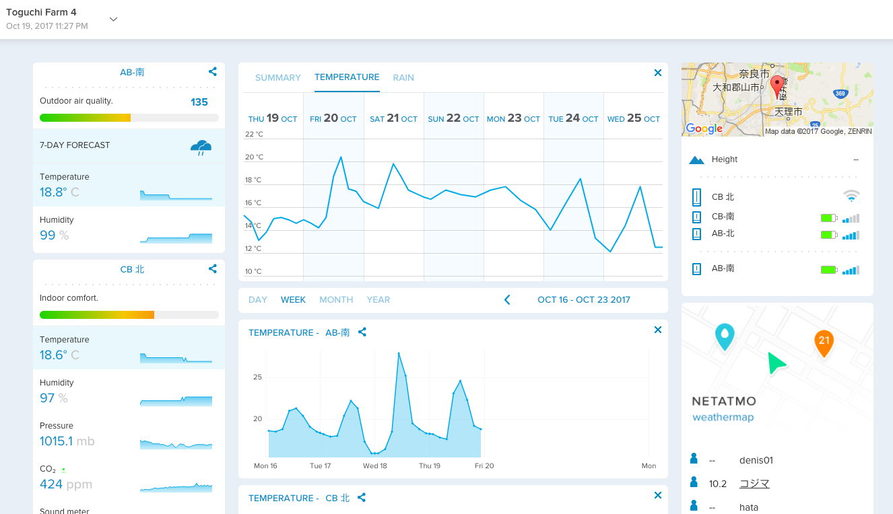

# Netatmo Sensor Validation in Greenhouse

In a Project "Development of a Simplified Smart agriculture system for small-scale greenhouse farming". 
Inexpensive sensors from [Netatmo ](https://www.netatmo.com/en-US/site/) were used.
The sensors as Weather Station have different modules, Indoor Module and Outside module. <br>



The sensors were installed in Strawberry Farm, The data collected is to be used for Real time Greenhouse environment monitoring and later for crop yield estimation.<br>

In this report, i show how the validation of the sensors(Indoor module, Additional module and outside mode) was done, using the collected data for three month time duration. <br>

- Load data csv data
- Wrangle data
- Do correlation analysis

For this analysis, we are use data from 
#### 2016/9/10 to 2016/12/10
#### NB. The time interval of the data is about 5 minutes


```python
#Packages for data manipulation
import pandas as pd
import numpy as np
```

The data set used is from September, 2016  to April, 2017.


```python
#Load using pandas pd.read_csv object for reading csv files
# View the head of the dataset
# View basic statistics of the dataset using df.describe
df1 = pd.read_csv('Indoor_24-7-2017.csv')
df2 = pd.read_csv('Add_module_24-7-2017.csv')
df3 = pd.read_csv('Outdoor module_24-7-2017.csv')
```


```python
df1.head(10)
```


<div>
<style>
    .dataframe thead tr:only-child th {
        text-align: right;
    }

    .dataframe thead th {
        text-align: left;
    }

    .dataframe tbody tr th {
        vertical-align: top;
    }
</style>
<table border="1" class="dataframe">
  <thead>
    <tr style="text-align: right;">
      <th></th>
      <th>Timestamp</th>
      <th>Timezone : Asia/Tokyo</th>
      <th>Temperature</th>
      <th>Humidity</th>
      <th>CO2</th>
      <th>Noise</th>
      <th>Pressure</th>
    </tr>
  </thead>
  <tbody>
    <tr>
      <th>0</th>
      <td>1473519692</td>
      <td>2016/09/11 0:01</td>
      <td>22.3</td>
      <td>97</td>
      <td>449.0</td>
      <td>37.0</td>
      <td>1004.1</td>
    </tr>
    <tr>
      <th>1</th>
      <td>1473519991</td>
      <td>2016/09/11 0:06</td>
      <td>22.3</td>
      <td>97</td>
      <td>458.0</td>
      <td>36.0</td>
      <td>1004.0</td>
    </tr>
    <tr>
      <th>2</th>
      <td>1473520294</td>
      <td>2016/09/11 0:11</td>
      <td>22.3</td>
      <td>97</td>
      <td>459.0</td>
      <td>36.0</td>
      <td>1004.0</td>
    </tr>
    <tr>
      <th>3</th>
      <td>1473520595</td>
      <td>2016/09/11 0:16</td>
      <td>22.2</td>
      <td>97</td>
      <td>465.0</td>
      <td>37.0</td>
      <td>1004.0</td>
    </tr>
    <tr>
      <th>4</th>
      <td>1473520897</td>
      <td>2016/09/11 0:21</td>
      <td>22.2</td>
      <td>97</td>
      <td>459.0</td>
      <td>37.0</td>
      <td>1003.9</td>
    </tr>
    <tr>
      <th>5</th>
      <td>1473521201</td>
      <td>2016/09/11 0:26</td>
      <td>22.1</td>
      <td>97</td>
      <td>452.0</td>
      <td>36.0</td>
      <td>1004.0</td>
    </tr>
    <tr>
      <th>6</th>
      <td>1473521504</td>
      <td>2016/09/11 0:31</td>
      <td>22.1</td>
      <td>97</td>
      <td>452.0</td>
      <td>36.0</td>
      <td>1004.0</td>
    </tr>
    <tr>
      <th>7</th>
      <td>1473521803</td>
      <td>2016/09/11 0:36</td>
      <td>22.1</td>
      <td>97</td>
      <td>448.0</td>
      <td>36.0</td>
      <td>1004.0</td>
    </tr>
    <tr>
      <th>8</th>
      <td>1473522105</td>
      <td>2016/09/11 0:41</td>
      <td>22.0</td>
      <td>97</td>
      <td>456.0</td>
      <td>36.0</td>
      <td>1004.2</td>
    </tr>
    <tr>
      <th>9</th>
      <td>1473522407</td>
      <td>2016/09/11 0:46</td>
      <td>22.0</td>
      <td>97</td>
      <td>452.0</td>
      <td>37.0</td>
      <td>1004.1</td>
    </tr>
  </tbody>
</table>
</div>


```python
df2.head(10)
```


<div>
<style>
    .dataframe thead tr:only-child th {
        text-align: right;
    }

    .dataframe thead th {
        text-align: left;
    }

    .dataframe tbody tr th {
        vertical-align: top;
    }
</style>
<table border="1" class="dataframe">
  <thead>
    <tr style="text-align: right;">
      <th></th>
      <th>Timestamp</th>
      <th>Timezone : Asia/Tokyo</th>
      <th>Temperature</th>
      <th>Humidity</th>
      <th>CO2</th>
    </tr>
  </thead>
  <tbody>
    <tr>
      <th>0</th>
      <td>1473519690</td>
      <td>2016/09/11 0:01</td>
      <td>22.1</td>
      <td>90</td>
      <td>440.0</td>
    </tr>
    <tr>
      <th>1</th>
      <td>1473519945</td>
      <td>2016/09/11 0:05</td>
      <td>22.1</td>
      <td>90</td>
      <td>446.0</td>
    </tr>
    <tr>
      <th>2</th>
      <td>1473520253</td>
      <td>2016/09/11 0:10</td>
      <td>22.0</td>
      <td>90</td>
      <td>444.0</td>
    </tr>
    <tr>
      <th>3</th>
      <td>1473520561</td>
      <td>2016/09/11 0:16</td>
      <td>22.0</td>
      <td>90</td>
      <td>436.0</td>
    </tr>
    <tr>
      <th>4</th>
      <td>1473520869</td>
      <td>2016/09/11 0:21</td>
      <td>21.9</td>
      <td>90</td>
      <td>425.0</td>
    </tr>
    <tr>
      <th>5</th>
      <td>1473521177</td>
      <td>2016/09/11 0:26</td>
      <td>21.9</td>
      <td>90</td>
      <td>421.0</td>
    </tr>
    <tr>
      <th>6</th>
      <td>1473521484</td>
      <td>2016/09/11 0:31</td>
      <td>21.9</td>
      <td>90</td>
      <td>427.0</td>
    </tr>
    <tr>
      <th>7</th>
      <td>1473521791</td>
      <td>2016/09/11 0:36</td>
      <td>21.8</td>
      <td>90</td>
      <td>420.0</td>
    </tr>
    <tr>
      <th>8</th>
      <td>1473522098</td>
      <td>2016/09/11 0:41</td>
      <td>21.8</td>
      <td>90</td>
      <td>426.0</td>
    </tr>
    <tr>
      <th>9</th>
      <td>1473522407</td>
      <td>2016/09/11 0:46</td>
      <td>21.8</td>
      <td>90</td>
      <td>438.0</td>
    </tr>
  </tbody>
</table>
</div>


```python
df3.head(10)
```


<div>
<style>
    .dataframe thead tr:only-child th {
        text-align: right;
    }

    .dataframe thead th {
        text-align: left;
    }

    .dataframe tbody tr th {
        vertical-align: top;
    }
</style>
<table border="1" class="dataframe">
  <thead>
    <tr style="text-align: right;">
      <th></th>
      <th>Timestamp</th>
      <th>Timezone : Asia/Tokyo</th>
      <th>Temperature</th>
      <th>Humidity</th>
    </tr>
  </thead>
  <tbody>
    <tr>
      <th>0</th>
      <td>1473519677</td>
      <td>2016/09/11 0:01</td>
      <td>21.9</td>
      <td>98</td>
    </tr>
    <tr>
      <th>1</th>
      <td>1473519983</td>
      <td>2016/09/11 0:06</td>
      <td>21.8</td>
      <td>98</td>
    </tr>
    <tr>
      <th>2</th>
      <td>1473520291</td>
      <td>2016/09/11 0:11</td>
      <td>21.8</td>
      <td>98</td>
    </tr>
    <tr>
      <th>3</th>
      <td>1473520548</td>
      <td>2016/09/11 0:15</td>
      <td>21.7</td>
      <td>98</td>
    </tr>
    <tr>
      <th>4</th>
      <td>1473520856</td>
      <td>2016/09/11 0:20</td>
      <td>21.7</td>
      <td>98</td>
    </tr>
    <tr>
      <th>5</th>
      <td>1473521164</td>
      <td>2016/09/11 0:26</td>
      <td>21.7</td>
      <td>98</td>
    </tr>
    <tr>
      <th>6</th>
      <td>1473521471</td>
      <td>2016/09/11 0:31</td>
      <td>21.6</td>
      <td>98</td>
    </tr>
    <tr>
      <th>7</th>
      <td>1473521778</td>
      <td>2016/09/11 0:36</td>
      <td>21.6</td>
      <td>98</td>
    </tr>
    <tr>
      <th>8</th>
      <td>1473522086</td>
      <td>2016/09/11 0:41</td>
      <td>21.6</td>
      <td>98</td>
    </tr>
    <tr>
      <th>9</th>
      <td>1473522394</td>
      <td>2016/09/11 0:46</td>
      <td>21.6</td>
      <td>99</td>
    </tr>
  </tbody>
</table>
</div>


```python
df1.describe()
```


<div>
<style>
    .dataframe thead tr:only-child th {
        text-align: right;
    }

    .dataframe thead th {
        text-align: left;
    }

    .dataframe tbody tr th {
        vertical-align: top;
    }
</style>
<table border="1" class="dataframe">
  <thead>
    <tr style="text-align: right;">
      <th></th>
      <th>Timestamp</th>
      <th>Temperature</th>
      <th>Humidity</th>
      <th>CO2</th>
      <th>Noise</th>
      <th>Pressure</th>
    </tr>
  </thead>
  <tbody>
    <tr>
      <th>count</th>
      <td>2.602800e+04</td>
      <td>26028.000000</td>
      <td>26028.000000</td>
      <td>26007.000000</td>
      <td>26001.000000</td>
      <td>26028.000000</td>
    </tr>
    <tr>
      <th>mean</th>
      <td>1.477436e+09</td>
      <td>19.019068</td>
      <td>83.330337</td>
      <td>595.654362</td>
      <td>41.612900</td>
      <td>1007.295470</td>
    </tr>
    <tr>
      <th>std</th>
      <td>2.260218e+06</td>
      <td>6.157426</td>
      <td>14.269096</td>
      <td>253.234269</td>
      <td>5.432547</td>
      <td>5.399331</td>
    </tr>
    <tr>
      <th>min</th>
      <td>1.473520e+09</td>
      <td>4.100000</td>
      <td>35.000000</td>
      <td>277.000000</td>
      <td>35.000000</td>
      <td>992.100000</td>
    </tr>
    <tr>
      <th>25%</th>
      <td>1.475477e+09</td>
      <td>14.000000</td>
      <td>76.000000</td>
      <td>439.000000</td>
      <td>38.000000</td>
      <td>1003.700000</td>
    </tr>
    <tr>
      <th>50%</th>
      <td>1.477439e+09</td>
      <td>19.300000</td>
      <td>86.000000</td>
      <td>507.000000</td>
      <td>40.000000</td>
      <td>1007.300000</td>
    </tr>
    <tr>
      <th>75%</th>
      <td>1.479398e+09</td>
      <td>23.500000</td>
      <td>95.000000</td>
      <td>643.000000</td>
      <td>44.000000</td>
      <td>1010.800000</td>
    </tr>
    <tr>
      <th>max</th>
      <td>1.481339e+09</td>
      <td>36.800000</td>
      <td>100.000000</td>
      <td>2158.000000</td>
      <td>75.000000</td>
      <td>1023.300000</td>
    </tr>
  </tbody>
</table>
</div>


```python
df2.describe()
```


<div>
<style>
    .dataframe thead tr:only-child th {
        text-align: right;
    }

    .dataframe thead th {
        text-align: left;
    }

    .dataframe tbody tr th {
        vertical-align: top;
    }
</style>
<table border="1" class="dataframe">
  <thead>
    <tr style="text-align: right;">
      <th></th>
      <th>Timestamp</th>
      <th>Temperature</th>
      <th>Humidity</th>
      <th>CO2</th>
    </tr>
  </thead>
  <tbody>
    <tr>
      <th>count</th>
      <td>2.586700e+04</td>
      <td>25867.000000</td>
      <td>25867.000000</td>
      <td>25859.000000</td>
    </tr>
    <tr>
      <th>mean</th>
      <td>1.477422e+09</td>
      <td>18.078602</td>
      <td>82.026211</td>
      <td>670.512317</td>
    </tr>
    <tr>
      <th>std</th>
      <td>2.257264e+06</td>
      <td>6.040126</td>
      <td>12.697125</td>
      <td>310.967791</td>
    </tr>
    <tr>
      <th>min</th>
      <td>1.473520e+09</td>
      <td>3.200000</td>
      <td>37.000000</td>
      <td>279.000000</td>
    </tr>
    <tr>
      <th>25%</th>
      <td>1.475467e+09</td>
      <td>13.100000</td>
      <td>75.000000</td>
      <td>463.000000</td>
    </tr>
    <tr>
      <th>50%</th>
      <td>1.477418e+09</td>
      <td>18.400000</td>
      <td>85.000000</td>
      <td>549.000000</td>
    </tr>
    <tr>
      <th>75%</th>
      <td>1.479364e+09</td>
      <td>22.700000</td>
      <td>92.000000</td>
      <td>772.000000</td>
    </tr>
    <tr>
      <th>max</th>
      <td>1.481339e+09</td>
      <td>35.900000</td>
      <td>100.000000</td>
      <td>2556.000000</td>
    </tr>
  </tbody>
</table>
</div>


```python
df3.describe()
```


<div>
<style>
    .dataframe thead tr:only-child th {
        text-align: right;
    }

    .dataframe thead th {
        text-align: left;
    }

    .dataframe tbody tr th {
        vertical-align: top;
    }
</style>
<table border="1" class="dataframe">
  <thead>
    <tr style="text-align: right;">
      <th></th>
      <th>Timestamp</th>
      <th>Temperature</th>
      <th>Humidity</th>
    </tr>
  </thead>
  <tbody>
    <tr>
      <th>count</th>
      <td>2.600200e+04</td>
      <td>26002.000000</td>
      <td>26002.000000</td>
    </tr>
    <tr>
      <th>mean</th>
      <td>1.477436e+09</td>
      <td>18.101011</td>
      <td>84.402892</td>
    </tr>
    <tr>
      <th>std</th>
      <td>2.259526e+06</td>
      <td>6.140094</td>
      <td>15.164692</td>
    </tr>
    <tr>
      <th>min</th>
      <td>1.473520e+09</td>
      <td>3.700000</td>
      <td>30.000000</td>
    </tr>
    <tr>
      <th>25%</th>
      <td>1.475477e+09</td>
      <td>13.000000</td>
      <td>78.000000</td>
    </tr>
    <tr>
      <th>50%</th>
      <td>1.477438e+09</td>
      <td>18.400000</td>
      <td>89.000000</td>
    </tr>
    <tr>
      <th>75%</th>
      <td>1.479396e+09</td>
      <td>22.900000</td>
      <td>96.000000</td>
    </tr>
    <tr>
      <th>max</th>
      <td>1.481339e+09</td>
      <td>36.600000</td>
      <td>100.000000</td>
    </tr>
  </tbody>
</table>
</div>


## Combining the three datafiles into one datafile
Now let us combine the three datafiles into one dataframe that we will use later. 
By creating a function to do that.  


```python
def combine_three_df(df1, df2,df3):
    '''
    This will return the result of combined dataset 
    based on column of 'Timezone : Asia/Tokyo'.
    '''
    return df1.merge(df2,on='Timezone : Asia/Tokyo').merge(df3,on='Timezone : Asia/Tokyo')

```

## Create function to find if there are some missing data


```python
def missing_data(df):
    '''
    Find the missing data in the dataset and return the percentage
    of the missing data
    '''
    missing_data = df.isnull().sum().to_frame()
    #Creates a column Percentage of % of missing data
    missing_data['Percentage'] =  (df.isnull().sum()/df.shape[0])*100
    missing_data.columns = ['Count_of_Missing_data','Percentage']
    missing_data = missing_data.round(3)
    return missing_data
```


```python
missing_data(df1)
```


<div>
<style>
    .dataframe thead tr:only-child th {
        text-align: right;
    }

    .dataframe thead th {
        text-align: left;
    }

    .dataframe tbody tr th {
        vertical-align: top;
    }
</style>
<table border="1" class="dataframe">
  <thead>
    <tr style="text-align: right;">
      <th></th>
      <th>Count_of_Missing_data</th>
      <th>Percentage</th>
    </tr>
  </thead>
  <tbody>
    <tr>
      <th>Timestamp</th>
      <td>0</td>
      <td>0.000</td>
    </tr>
    <tr>
      <th>Timezone : Asia/Tokyo</th>
      <td>0</td>
      <td>0.000</td>
    </tr>
    <tr>
      <th>Temperature</th>
      <td>0</td>
      <td>0.000</td>
    </tr>
    <tr>
      <th>Humidity</th>
      <td>0</td>
      <td>0.000</td>
    </tr>
    <tr>
      <th>CO2</th>
      <td>21</td>
      <td>0.081</td>
    </tr>
    <tr>
      <th>Noise</th>
      <td>27</td>
      <td>0.104</td>
    </tr>
    <tr>
      <th>Pressure</th>
      <td>0</td>
      <td>0.000</td>
    </tr>
  </tbody>
</table>
</div>


```python
missing_data(df2)
```


<div>
<style>
    .dataframe thead tr:only-child th {
        text-align: right;
    }

    .dataframe thead th {
        text-align: left;
    }

    .dataframe tbody tr th {
        vertical-align: top;
    }
</style>
<table border="1" class="dataframe">
  <thead>
    <tr style="text-align: right;">
      <th></th>
      <th>Count_of_Missing_data</th>
      <th>Percentage</th>
    </tr>
  </thead>
  <tbody>
    <tr>
      <th>Timestamp</th>
      <td>0</td>
      <td>0.000</td>
    </tr>
    <tr>
      <th>Timezone : Asia/Tokyo</th>
      <td>0</td>
      <td>0.000</td>
    </tr>
    <tr>
      <th>Temperature</th>
      <td>0</td>
      <td>0.000</td>
    </tr>
    <tr>
      <th>Humidity</th>
      <td>0</td>
      <td>0.000</td>
    </tr>
    <tr>
      <th>CO2</th>
      <td>8</td>
      <td>0.031</td>
    </tr>
  </tbody>
</table>
</div>


```python
missing_data(df3)
```


<div>
<style>
    .dataframe thead tr:only-child th {
        text-align: right;
    }

    .dataframe thead th {
        text-align: left;
    }

    .dataframe tbody tr th {
        vertical-align: top;
    }
</style>
<table border="1" class="dataframe">
  <thead>
    <tr style="text-align: right;">
      <th></th>
      <th>Count_of_Missing_data</th>
      <th>Percentage</th>
    </tr>
  </thead>
  <tbody>
    <tr>
      <th>Timestamp</th>
      <td>0</td>
      <td>0.0</td>
    </tr>
    <tr>
      <th>Timezone : Asia/Tokyo</th>
      <td>0</td>
      <td>0.0</td>
    </tr>
    <tr>
      <th>Temperature</th>
      <td>0</td>
      <td>0.0</td>
    </tr>
    <tr>
      <th>Humidity</th>
      <td>0</td>
      <td>0.0</td>
    </tr>
  </tbody>
</table>
</div>


```python
df_combined = combine_three_df(df1,df2,df3)
```


```python
df_combined.head()
```


<div>
<style>
    .dataframe thead tr:only-child th {
        text-align: right;
    }

    .dataframe thead th {
        text-align: left;
    }

    .dataframe tbody tr th {
        vertical-align: top;
    }
</style>
<table border="1" class="dataframe">
  <thead>
    <tr style="text-align: right;">
      <th></th>
      <th>Timestamp_x</th>
      <th>Timezone : Asia/Tokyo</th>
      <th>Temperature_x</th>
      <th>Humidity_x</th>
      <th>CO2_x</th>
      <th>Noise</th>
      <th>Pressure</th>
      <th>Timestamp_y</th>
      <th>Temperature_y</th>
      <th>Humidity_y</th>
      <th>CO2_y</th>
      <th>Timestamp</th>
      <th>Temperature</th>
      <th>Humidity</th>
    </tr>
  </thead>
  <tbody>
    <tr>
      <th>0</th>
      <td>1473519692</td>
      <td>2016/09/11 0:01</td>
      <td>22.3</td>
      <td>97</td>
      <td>449.0</td>
      <td>37.0</td>
      <td>1004.1</td>
      <td>1473519690</td>
      <td>22.1</td>
      <td>90</td>
      <td>440.0</td>
      <td>1473519677</td>
      <td>21.9</td>
      <td>98</td>
    </tr>
    <tr>
      <th>1</th>
      <td>1473521201</td>
      <td>2016/09/11 0:26</td>
      <td>22.1</td>
      <td>97</td>
      <td>452.0</td>
      <td>36.0</td>
      <td>1004.0</td>
      <td>1473521177</td>
      <td>21.9</td>
      <td>90</td>
      <td>421.0</td>
      <td>1473521164</td>
      <td>21.7</td>
      <td>98</td>
    </tr>
    <tr>
      <th>2</th>
      <td>1473521504</td>
      <td>2016/09/11 0:31</td>
      <td>22.1</td>
      <td>97</td>
      <td>452.0</td>
      <td>36.0</td>
      <td>1004.0</td>
      <td>1473521484</td>
      <td>21.9</td>
      <td>90</td>
      <td>427.0</td>
      <td>1473521471</td>
      <td>21.6</td>
      <td>98</td>
    </tr>
    <tr>
      <th>3</th>
      <td>1473521803</td>
      <td>2016/09/11 0:36</td>
      <td>22.1</td>
      <td>97</td>
      <td>448.0</td>
      <td>36.0</td>
      <td>1004.0</td>
      <td>1473521791</td>
      <td>21.8</td>
      <td>90</td>
      <td>420.0</td>
      <td>1473521778</td>
      <td>21.6</td>
      <td>98</td>
    </tr>
    <tr>
      <th>4</th>
      <td>1473522105</td>
      <td>2016/09/11 0:41</td>
      <td>22.0</td>
      <td>97</td>
      <td>456.0</td>
      <td>36.0</td>
      <td>1004.2</td>
      <td>1473522098</td>
      <td>21.8</td>
      <td>90</td>
      <td>426.0</td>
      <td>1473522086</td>
      <td>21.6</td>
      <td>98</td>
    </tr>
  </tbody>
</table>
</div>


## For this analysis, we will only deal with Temperature data, so drop other irrelevant data


```python
only_temp_dat = df_combined.drop(['Timestamp_x','Humidity_x','CO2_x','Humidity','Timestamp','Noise','Pressure','Timestamp_y','Humidity_y','CO2_y'],axis=1,inplace=False)
```


```python
only_temp_dat.head(10)
```


<div>
<style>
    .dataframe thead tr:only-child th {
        text-align: right;
    }

    .dataframe thead th {
        text-align: left;
    }

    .dataframe tbody tr th {
        vertical-align: top;
    }
</style>
<table border="1" class="dataframe">
  <thead>
    <tr style="text-align: right;">
      <th></th>
      <th>Timezone : Asia/Tokyo</th>
      <th>Temperature_x</th>
      <th>Temperature_y</th>
      <th>Temperature</th>
    </tr>
  </thead>
  <tbody>
    <tr>
      <th>0</th>
      <td>2016/09/11 0:01</td>
      <td>22.3</td>
      <td>22.1</td>
      <td>21.9</td>
    </tr>
    <tr>
      <th>1</th>
      <td>2016/09/11 0:26</td>
      <td>22.1</td>
      <td>21.9</td>
      <td>21.7</td>
    </tr>
    <tr>
      <th>2</th>
      <td>2016/09/11 0:31</td>
      <td>22.1</td>
      <td>21.9</td>
      <td>21.6</td>
    </tr>
    <tr>
      <th>3</th>
      <td>2016/09/11 0:36</td>
      <td>22.1</td>
      <td>21.8</td>
      <td>21.6</td>
    </tr>
    <tr>
      <th>4</th>
      <td>2016/09/11 0:41</td>
      <td>22.0</td>
      <td>21.8</td>
      <td>21.6</td>
    </tr>
    <tr>
      <th>5</th>
      <td>2016/09/11 0:46</td>
      <td>22.0</td>
      <td>21.8</td>
      <td>21.6</td>
    </tr>
    <tr>
      <th>6</th>
      <td>2016/09/11 0:51</td>
      <td>22.0</td>
      <td>21.8</td>
      <td>21.6</td>
    </tr>
    <tr>
      <th>7</th>
      <td>2016/09/11 0:56</td>
      <td>22.0</td>
      <td>21.8</td>
      <td>21.6</td>
    </tr>
    <tr>
      <th>8</th>
      <td>2016/09/11 1:01</td>
      <td>22.0</td>
      <td>21.7</td>
      <td>21.6</td>
    </tr>
    <tr>
      <th>9</th>
      <td>2016/09/11 1:06</td>
      <td>22.0</td>
      <td>21.7</td>
      <td>21.6</td>
    </tr>
  </tbody>
</table>
</div>


```python
#Change column name 
only_temp_dat.columns = ['datetime_col', 'Indoor','Additional','Outdoor']
```


```python
only_temp_dat.describe()
```


<div>
<style>
    .dataframe thead tr:only-child th {
        text-align: right;
    }

    .dataframe thead th {
        text-align: left;
    }

    .dataframe tbody tr th {
        vertical-align: top;
    }
</style>
<table border="1" class="dataframe">
  <thead>
    <tr style="text-align: right;">
      <th></th>
      <th>Indoor</th>
      <th>Additional</th>
      <th>Outdoor</th>
    </tr>
  </thead>
  <tbody>
    <tr>
      <th>count</th>
      <td>12268.000000</td>
      <td>12268.000000</td>
      <td>12268.000000</td>
    </tr>
    <tr>
      <th>mean</th>
      <td>19.279076</td>
      <td>18.349967</td>
      <td>18.388270</td>
    </tr>
    <tr>
      <th>std</th>
      <td>6.066227</td>
      <td>5.983649</td>
      <td>6.047829</td>
    </tr>
    <tr>
      <th>min</th>
      <td>4.100000</td>
      <td>3.300000</td>
      <td>3.700000</td>
    </tr>
    <tr>
      <th>25%</th>
      <td>14.300000</td>
      <td>13.500000</td>
      <td>13.400000</td>
    </tr>
    <tr>
      <th>50%</th>
      <td>19.600000</td>
      <td>18.700000</td>
      <td>18.800000</td>
    </tr>
    <tr>
      <th>75%</th>
      <td>23.500000</td>
      <td>22.800000</td>
      <td>23.000000</td>
    </tr>
    <tr>
      <th>max</th>
      <td>36.400000</td>
      <td>35.500000</td>
      <td>36.000000</td>
    </tr>
  </tbody>
</table>
</div>


```python
missing_data(only_temp_dat)
```


<div>
<style>
    .dataframe thead tr:only-child th {
        text-align: right;
    }

    .dataframe thead th {
        text-align: left;
    }

    .dataframe tbody tr th {
        vertical-align: top;
    }
</style>
<table border="1" class="dataframe">
  <thead>
    <tr style="text-align: right;">
      <th></th>
      <th>Count_of_Missing_data</th>
      <th>Percentage</th>
    </tr>
  </thead>
  <tbody>
    <tr>
      <th>datetime_col</th>
      <td>0</td>
      <td>0.0</td>
    </tr>
    <tr>
      <th>Indoor</th>
      <td>0</td>
      <td>0.0</td>
    </tr>
    <tr>
      <th>Additional</th>
      <td>0</td>
      <td>0.0</td>
    </tr>
    <tr>
      <th>Outdoor</th>
      <td>0</td>
      <td>0.0</td>
    </tr>
  </tbody>
</table>
</div>


## Correlation Test.
We perform correlation test to check how the sensor data(Using only Temp) are related


```python
only_temp_dat.corr()
```


<div>
<style>
    .dataframe thead tr:only-child th {
        text-align: right;
    }

    .dataframe thead th {
        text-align: left;
    }

    .dataframe tbody tr th {
        vertical-align: top;
    }
</style>
<table border="1" class="dataframe">
  <thead>
    <tr style="text-align: right;">
      <th></th>
      <th>Indoor</th>
      <th>Additional</th>
      <th>Outdoor</th>
    </tr>
  </thead>
  <tbody>
    <tr>
      <th>Indoor</th>
      <td>1.000000</td>
      <td>0.988139</td>
      <td>0.994234</td>
    </tr>
    <tr>
      <th>Additional</th>
      <td>0.988139</td>
      <td>1.000000</td>
      <td>0.992062</td>
    </tr>
    <tr>
      <th>Outdoor</th>
      <td>0.994234</td>
      <td>0.992062</td>
      <td>1.000000</td>
    </tr>
  </tbody>
</table>
</div>


# Conclusion
From the above correlation analysis, We find that the sensor data are very slight different<br>

Since the Sensors were distributed in the Greenhouse<br>

We could still use any of the sensor data in the greenhouse for analysis.

